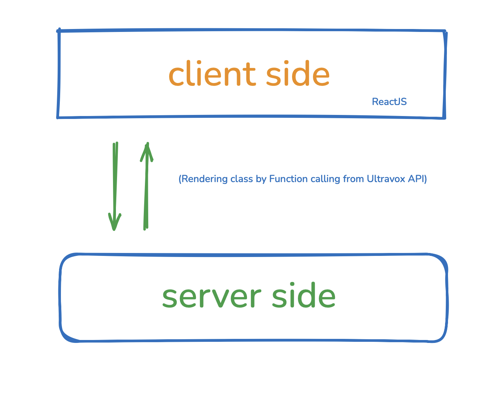

# Kaldi Assistant

Here is How to use Kaldi Assistant


Built on best-in-class, open-weight model, Ultravox Realtime provides a fully hosted platform for creating real-time, low-latency voice AI applications.

[Ultravox](https://ultravox.com/docs/ultravox-client)

The way it works is simple. You just need to provide it with a voice command, and it will process your voice and then call the class and class is being used to control entire UI just we have to play with class and these classes are being written by our Realtime Speech2Speech LLM by function calling like for that we are using ```fixie-ai/ultravox-70```.

Here is the Image which will help you understand:


# Guide

```
git clone https://github.com/manishindiyaar/multimodal_starbucks_assitant_liveai.git
```

```
pnpm install
```

```
set your ULTRAVOX_API_KEY in your .env.local file 
```
```
pnpm run dev
```

This is How our app look like user just need to click on Assitant button and they will be able to order food without touching screen.


Here is the Demo Link: 
[Kaldi Assitant for Starbucks](https://cafe-ai.netlify.app)